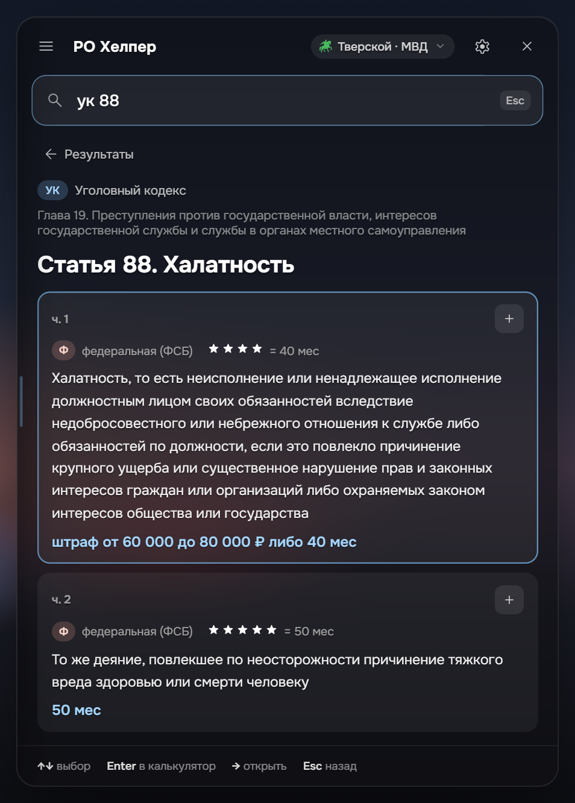
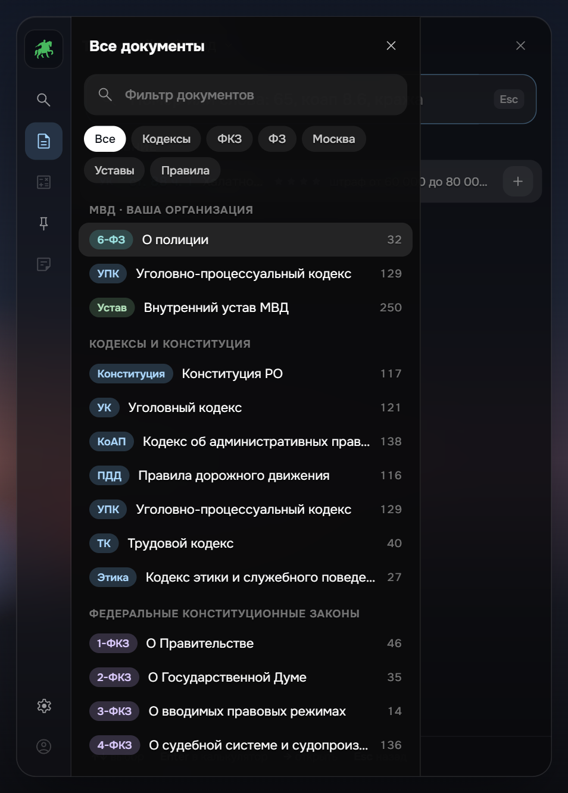

<div align="center">


# ПРОТОКОЛ

**Законы Russia Online поверх игры — и ИИ, который разберёт ситуацию по этим законам**

Поиск по законам сервера, ИИ-разбор ситуации, калькулятор срока и штрафа, обвинение одной кнопкой

[**Скачать для Windows**](https://github.com/AidenArokij/protocol/releases/latest)

</div>

<p align="center">
  
  
  
</p>

## ИИ-разбор ситуации

Нажмите ✨ в шапке и опишите ситуацию своими словами: «человек в маске с электродубинкой стоит у здания МВД — что ему грозит?». ПРОТОКОЛ найдёт статьи в законах вашего сервера, а ИИ (Google Gemini) объяснит, что к чему.

- **ИИ не выдумывает законы.** Он видит только статьи, которые нашёл поиск по законам сервера, и ссылается только на них. Каждая статья в ответе открывается по клику — проверьте сами.
- **С разных сторон:** Государство, Гражданский, Адвокат, Крайм.
- **Прямо в игре:** держите Alt + W и говорите — ответ появится карточкой поверх игры, окно не открывается.
- **Составляет документы** — рапорт, протокол задержания, заявление, жалобу, иск — со ссылками на статьи сервера.
- **Тренажёр к экзаменам фракций** и **проверка отыгровки** из игрового чата.
- **Помнит разговор:** можно уточнять — «а если он был без маски?».
- Нужен бесплатный ключ Gemini с [aistudio.google.com](https://aistudio.google.com/apikey): «Настройки» → «ИИ-разбор». Ключ хранится только на вашем компьютере.

## Что ещё умеет

- **Открывается поверх игры** по горячей клавише (по умолчанию <kbd>Alt</kbd>+<kbd>Q</kbd>) и прячется обратно, возвращая фокус игре.
- **Ищет как человек думает**: по номеру (`65`, `коап 8.6`, `ук 104 ч 2`), по словам и их формам, по жаргону (`ствол` → огнестрельное оружие) и с опечатками. Наказание и звёзды видны прямо в результатах.
- **Три сервера**: Тверской, Арбатский и Кутузовский — кодексы, законы, уставы организаций и правила проекта. Документы вашей организации — первыми.
- **Калькулятор по закону своего сервера**: поглощение или сложение наказаний, потолки срока, покушение и приготовление, залог, звёзды.
- **Обвинение в буфер** одной кнопкой или <kbd>Ctrl</kbd>+<kbd>C</kbd>.
- **Закреплённые карточки** статей и итога калькулятора поверх игры: перетаскиваются, соединяются в блоки, сохраняются наборами.
- **«Что изменилось»** после обновления законов, в виде «было → стало».
- **Режим стримера**: окно видно вам, но не видно в OBS, Discord и на записи экрана. **Запуск вместе с Windows** — ждёт в трее горячей клавиши.
- **Работает без интернета** (кроме ИИ): законы встроены в программу, а свежие правки приходят с GitHub сами.

## Установка

1. Скачайте `PROTOCOL_…_x64-setup.exe` со страницы [последнего релиза](https://github.com/AidenArokij/protocol/releases/latest).
2. Запустите. Права администратора не нужны.
3. Установщик без цифровой подписи, поэтому Windows может показать «Windows защитила ваш компьютер». Нажмите **Подробнее → Выполнить в любом случае**.
4. При первом запуске выберите сервер, организацию и горячую клавишу. Для ИИ вставьте ключ Gemini в настройках.
5. В игре включите **«Оконный без рамки»** («Графика» → «Тип экрана») и выключите **«Отключение звука при потере фокуса»** («Аудио»).

Нужна Windows 10 или 11. Иконка программы живёт в трее: там же «Показать / скрыть» и «Выход».

## Горячие клавиши в оверлее

| Клавиша | Действие |
| --- | --- |
| <kbd>↑</kbd> <kbd>↓</kbd> | выбрать статью |
| <kbd>Enter</kbd> | добавить в калькулятор; в ИИ-разборе — спросить ИИ |
| <kbd>→</kbd> | открыть статью целиком |
| <kbd>Ctrl</kbd>+<kbd>C</kbd> | скопировать обвинение |
| <kbd>Esc</kbd> | шаг назад; на главном экране — скрыть оверлей |

## Безопасность и конфиденциальность

ПРОТОКОЛ — обычное окно поверх игры: не читает и не изменяет память игры, не внедряется в её процесс, не нажимает клавиши за вас. Аккаунтов, аналитики и телеметрии нет. В интернет программа обращается за обновлениями к GitHub и — только когда вы спрашиваете ИИ — к Google Gemini. Подробно — в [политике конфиденциальности](PRIVACY.md).

## Для разработчиков

Tauri 2 (Rust) + React и TypeScript. Нужны [Node.js](https://nodejs.org/) 24, [Rust](https://rustup.rs/) и WebView2.

```bash
npm install
npm run dev          # в браузере, без игры: http://127.0.0.1:1420
npm run tauri dev    # настоящий оверлей
npm test             # тесты
npm run import       # пересобрать законы из data/<сервер>/sources
```

- `src/core` — поиск, подбор статей для ИИ (`situation.ts`), калькулятор (чистый TypeScript)
- `src/ui/ai.ts`, `src/ui/AiView.tsx` — ИИ-разбор
- `src/importer` — разбор текстов законов с форума
- `src-tauri` — нативная часть: горячая клавиша, трей, окно карточек, обновления

Выпуск версии: поднять версию в `package.json`, написать раздел в [CHANGELOG.md](CHANGELOG.md), поставить тег `vX.Y.Z` — GitHub Actions соберёт установщик и черновик релиза. Для подписи обновлений нужны секреты `TAURI_SIGNING_PRIVATE_KEY` и `TAURI_SIGNING_PRIVATE_KEY_PASSWORD`.

## Авторы

- **AidenArokij** — ПРОТОКОЛ, ИИ-разбор.
- **skyze** — [РО Хелпер](https://github.com/skyyyzeee/ro-helper), на котором основан ПРОТОКОЛ: поиск, калькулятор, карточки, разбор законов с форума.

Нашли ошибку — создайте [issue](https://github.com/AidenArokij/protocol/issues).

## Лицензия

Код — [MIT](LICENSE). Тексты законов, уставов и правил принадлежат проекту Russia Online и их авторам; лицензия MIT на них не распространяется.

ПРОТОКОЛ — неофициальная программа, она не связана с администрацией Russia Online.
